# Design Document - Comprehensive Deployment Testing & Validation

## Overview

This design document outlines a comprehensive testing and validation framework for the TacticalOps Platform deployment. The framework utilizes Playwright MCP for automated testing, security scanning tools, and systematic validation procedures to ensure the platform meets all operational requirements.

## Architecture

### Testing Framework Architecture

```mermaid
graph TB
    A[Test Orchestrator] --> B[Deployment Validator]
    A --> C[Security Scanner]
    A --> D[UI/UX Tester]
    A --> E[API Tester]
    A --> F[Performance Monitor]
    
    B --> B1[Container Health]
    B --> B2[Service Connectivity]
    B --> B3[Database Schema]
    B --> B4[SSL/TLS Config]
    
    C --> C1[Authentication Tests]
    C --> C2[Authorization Tests]
    C --> C3[Vulnerability Scan]
    C --> C4[Security Headers]
    
    D --> D1[Responsive Design]
    D --> D2[Theme Testing]
    D --> D3[Accessibility]
    D --> D4[Browser Compatibility]
    
    E --> E1[REST API Tests]
    E --> E2[WebSocket Tests]
    E --> E3[Agent API Tests]
    E --> E4[Error Handling]
    
    F --> F1[Load Testing]
    F --> F2[Performance Metrics]
    F --> F3[Resource Usage]
    F --> F4[Response Times]
```



### Testing Layers

1. **Infrastructure Layer**: Docker containers, networking, SSL/TLS
2. **Database Layer**: PostgreSQL, Redis, MinIO connectivity and integrity
3. **Application Layer**: API endpoints, business logic, error handling
4. **Security Layer**: Authentication, authorization, vulnerability assessment
5. **User Interface Layer**: Responsive design, accessibility, browser compatibility
6. **Integration Layer**: End-to-end workflows, real-time features
7. **Performance Layer**: Load testing, response times, resource usage

## Components and Interfaces

### Test Orchestrator

**Purpose**: Central coordinator for all testing activities

**Key Functions**:
- Execute test suites in proper sequence
- Collect and aggregate test results
- Generate comprehensive test reports
- Handle test environment setup and teardown

**Interface**:
```typescript
interface TestOrchestrator {
  executeTestSuite(suite: TestSuite): Promise<TestResults>
  generateReport(results: TestResults[]): TestReport
  setupEnvironment(): Promise<void>
  teardownEnvironment(): Promise<void>
}
```

### Deployment Validator

**Purpose**: Validate deployment status and infrastructure health

**Key Functions**:
- Check Docker container status and health
- Validate service connectivity and networking
- Verify database schema and data integrity
- Test SSL/TLS configuration and certificates

**Interface**:
```typescript
interface DeploymentValidator {
  validateContainers(): Promise<ContainerStatus[]>
  validateServices(): Promise<ServiceHealth[]>
  validateDatabase(): Promise<DatabaseStatus>
  validateSSL(): Promise<SSLStatus>
}
```

### Security Scanner

**Purpose**: Comprehensive security testing and vulnerability assessment

**Key Functions**:
- Test authentication and authorization mechanisms
- Scan for common security vulnerabilities
- Validate security headers and configurations
- Test input validation and sanitization

**Interface**:
```typescript
interface SecurityScanner {
  testAuthentication(): Promise<AuthTestResults>
  scanVulnerabilities(): Promise<VulnerabilityReport>
  validateSecurityHeaders(): Promise<HeaderValidation>
  testInputValidation(): Promise<ValidationResults>
}
```

### UI/UX Tester (Playwright-based)

**Purpose**: Automated testing of user interface and user experience

**Key Functions**:
- Test responsive design across devices
- Validate theme switching and accessibility
- Test interactive elements and workflows
- Verify browser compatibility

**Interface**:
```typescript
interface UITester {
  testResponsiveDesign(): Promise<ResponsiveResults>
  testThemes(): Promise<ThemeResults>
  testAccessibility(): Promise<AccessibilityResults>
  testBrowserCompatibility(): Promise<CompatibilityResults>
}
```

### API Tester

**Purpose**: Comprehensive API endpoint testing

**Key Functions**:
- Test all REST API endpoints
- Validate WebSocket connections
- Test agent API functionality
- Verify error handling and responses

**Interface**:
```typescript
interface APITester {
  testRESTEndpoints(): Promise<APITestResults>
  testWebSockets(): Promise<WebSocketResults>
  testAgentAPIs(): Promise<AgentAPIResults>
  testErrorHandling(): Promise<ErrorHandlingResults>
}
```

### Performance Monitor

**Purpose**: Performance and load testing

**Key Functions**:
- Execute load testing scenarios
- Monitor performance metrics
- Track resource usage
- Measure response times

**Interface**:
```typescript
interface PerformanceMonitor {
  executeLoadTest(): Promise<LoadTestResults>
  monitorPerformance(): Promise<PerformanceMetrics>
  trackResourceUsage(): Promise<ResourceUsage>
  measureResponseTimes(): Promise<ResponseTimeMetrics>
}
```

## Data Models

### Test Results Schema

```typescript
interface TestResults {
  testSuite: string
  timestamp: Date
  status: 'PASSED' | 'FAILED' | 'WARNING'
  duration: number
  results: TestCaseResult[]
  summary: TestSummary
}

interface TestCaseResult {
  testCase: string
  status: 'PASSED' | 'FAILED' | 'SKIPPED'
  duration: number
  message?: string
  screenshot?: string
  logs?: string[]
}

interface TestSummary {
  total: number
  passed: number
  failed: number
  skipped: number
  warnings: number
}
```

### Security Assessment Schema

```typescript
interface SecurityAssessment {
  timestamp: Date
  overallRisk: 'LOW' | 'MEDIUM' | 'HIGH' | 'CRITICAL'
  vulnerabilities: Vulnerability[]
  recommendations: SecurityRecommendation[]
  complianceStatus: ComplianceStatus
}

interface Vulnerability {
  id: string
  severity: 'LOW' | 'MEDIUM' | 'HIGH' | 'CRITICAL'
  category: string
  description: string
  location: string
  remediation: string
}
```

### Performance Metrics Schema

```typescript
interface PerformanceMetrics {
  timestamp: Date
  responseTime: {
    average: number
    p95: number
    p99: number
  }
  throughput: {
    requestsPerSecond: number
    concurrentUsers: number
  }
  resourceUsage: {
    cpu: number
    memory: number
    disk: number
    network: number
  }
}
```

## Error Handling

### Test Failure Management

1. **Graceful Degradation**: Continue testing even if individual tests fail
2. **Error Categorization**: Classify errors by severity and impact
3. **Retry Logic**: Implement intelligent retry mechanisms for flaky tests
4. **Detailed Logging**: Capture comprehensive logs and screenshots for failures

### Security Issue Handling

1. **Immediate Alerting**: Critical security issues trigger immediate notifications
2. **Risk Assessment**: Automatic risk scoring and prioritization
3. **Remediation Guidance**: Provide specific steps to fix identified issues
4. **Compliance Tracking**: Monitor compliance with security standards

## Testing Strategy

### Test Execution Phases

1. **Pre-deployment Validation**: Infrastructure and configuration checks
2. **Deployment Verification**: Service startup and connectivity validation
3. **Functional Testing**: Core functionality and API testing
4. **Security Assessment**: Comprehensive security testing
5. **Performance Testing**: Load and performance validation
6. **User Experience Testing**: UI/UX and accessibility testing
7. **Integration Testing**: End-to-end workflow validation
8. **Post-deployment Monitoring**: Continuous health monitoring

### Test Data Management

1. **Test Data Generation**: Automated generation of realistic test data
2. **Data Isolation**: Separate test data from production data
3. **Data Cleanup**: Automatic cleanup of test data after execution
4. **Data Privacy**: Ensure test data doesn't contain sensitive information

### Continuous Testing

1. **Automated Execution**: Tests run automatically on deployment
2. **Scheduled Testing**: Regular testing schedules for ongoing validation
3. **Trigger-based Testing**: Tests triggered by specific events or changes
4. **Regression Testing**: Comprehensive regression testing for updates

## Reporting and Analytics

### Test Report Generation

1. **Executive Summary**: High-level overview for stakeholders
2. **Detailed Results**: Comprehensive test results with evidence
3. **Trend Analysis**: Historical comparison and trend identification
4. **Actionable Insights**: Specific recommendations for improvements

### Dashboard and Monitoring

1. **Real-time Dashboard**: Live view of test execution and results
2. **Alert System**: Immediate notifications for critical issues
3. **Metrics Tracking**: Key performance indicators and trends
4. **Historical Analysis**: Long-term trend analysis and reporting

## Security Considerations

### Test Environment Security

1. **Isolated Testing**: Tests run in isolated environments
2. **Credential Management**: Secure handling of test credentials
3. **Data Protection**: Encryption of test data and results
4. **Access Control**: Restricted access to testing infrastructure

### Security Test Coverage

1. **OWASP Top 10**: Coverage of all OWASP top 10 vulnerabilities
2. **Authentication Testing**: Comprehensive auth mechanism testing
3. **Authorization Testing**: Role-based access control validation
4. **Input Validation**: Thorough input sanitization testing
5. **Session Management**: Session security and lifecycle testing

## Implementation Considerations

### Tool Integration

1. **Playwright MCP**: Primary UI testing framework
2. **Security Scanners**: Integration with security scanning tools
3. **Performance Tools**: Load testing and performance monitoring
4. **CI/CD Integration**: Seamless integration with deployment pipelines

### Scalability and Maintenance

1. **Modular Design**: Easily extensible test framework
2. **Configuration Management**: Centralized test configuration
3. **Version Control**: Test scripts and configurations under version control
4. **Documentation**: Comprehensive documentation for maintenance

This design provides a robust foundation for comprehensive testing and validation of the TacticalOps Platform deployment, ensuring mission-critical reliability and security.