# Design Document - Comprehensive Testing & Validation

## Overview

This design document outlines the comprehensive testing and validation system for the TacticalOps platform, including domain configuration fixes, SSL certificate setup, and complete feature testing across all system components.

## Architecture

### Testing Framework Architecture

```mermaid
graph TB
    A[Test Controller] --> B[Domain & SSL Tests]
    A --> C[Authentication Tests]
    A --> D[Dashboard Tests]
    A --> E[API Tests]
    A --> F[Database Tests]
    A --> G[Security Tests]
    A --> H[Performance Tests]
    A --> I[UI/UX Tests]
    A --> J[Integration Tests]
    
    B --> K[SSL Certificate Validation]
    B --> L[Domain Resolution]
    B --> M[Cloudflare Configuration]
    
    C --> N[Login/Logout Flow]
    C --> O[JWT Token Validation]
    C --> P[Session Management]
    
    D --> Q[Real-time Updates]
    D --> R[Component Rendering]
    D --> S[Data Visualization]
    
    E --> T[Health Endpoints]
    E --> U[CRUD Operations]
    E --> V[Error Handling]
    
    F --> W[Connection Testing]
    F --> X[Data Integrity]
    F --> Y[Query Performance]
    
    G --> Z[Security Headers]
    G --> AA[Input Validation]
    G --> BB[Authentication Security]
    
    H --> CC[Response Times]
    H --> DD[Load Testing]
    H --> EE[Resource Usage]
    
    I --> FF[Responsive Design]
    I --> GG[Accessibility]
    I --> HH[User Experience]
    
    J --> II[Service Integration]
    J --> JJ[Data Flow]
    J --> KK[System Recovery]
```



### Domain & SSL Configuration Design

#### SSL Certificate Strategy
1. **Cloudflare Origin Certificate**: Use Cloudflare's origin certificate for secure communication between Cloudflare and the VPS
2. **Full (Strict) SSL Mode**: Configure Cloudflare to use Full (Strict) SSL mode
3. **HSTS Headers**: Implement HTTP Strict Transport Security headers
4. **Certificate Validation**: Automated certificate validation and renewal

#### Domain Configuration
1. **DNS Configuration**: Ensure proper A record pointing to VPS IP
2. **Cloudflare Proxy**: Configure orange cloud (proxied) for security and performance
3. **SSL/TLS Settings**: Configure appropriate SSL/TLS settings in Cloudflare
4. **Origin Rules**: Set up origin rules for proper backend communication

### Testing Components Design

#### 1. Domain & SSL Testing Module
```typescript
interface DomainSSLTests {
  testSSLCertificate(): Promise<TestResult>;
  testDomainResolution(): Promise<TestResult>;
  testHTTPSRedirect(): Promise<TestResult>;
  testSecurityHeaders(): Promise<TestResult>;
  testCloudflareConfiguration(): Promise<TestResult>;
}
```

#### 2. Authentication Testing Module
```typescript
interface AuthenticationTests {
  testValidLogin(): Promise<TestResult>;
  testInvalidLogin(): Promise<TestResult>;
  testJWTTokenValidation(): Promise<TestResult>;
  testSessionManagement(): Promise<TestResult>;
  testLogout(): Promise<TestResult>;
  testProtectedRoutes(): Promise<TestResult>;
}
```

#### 3. Dashboard Testing Module
```typescript
interface DashboardTests {
  testDashboardLoad(): Promise<TestResult>;
  testRealTimeUpdates(): Promise<TestResult>;
  testComponentRendering(): Promise<TestResult>;
  testResponsiveDesign(): Promise<TestResult>;
  testDataVisualization(): Promise<TestResult>;
}
```

#### 4. API Testing Module
```typescript
interface APITests {
  testHealthEndpoints(): Promise<TestResult>;
  testAuthenticationEndpoints(): Promise<TestResult>;
  testDeviceEndpoints(): Promise<TestResult>;
  testDashboardEndpoints(): Promise<TestResult>;
  testErrorHandling(): Promise<TestResult>;
}
```

#### 5. Database Testing Module
```typescript
interface DatabaseTests {
  testConnection(): Promise<TestResult>;
  testUserOperations(): Promise<TestResult>;
  testDeviceOperations(): Promise<TestResult>;
  testDataIntegrity(): Promise<TestResult>;
  testQueryPerformance(): Promise<TestResult>;
}
```

#### 6. Security Testing Module
```typescript
interface SecurityTests {
  testSecurityHeaders(): Promise<TestResult>;
  testPasswordHashing(): Promise<TestResult>;
  testJWTSecurity(): Promise<TestResult>;
  testInputValidation(): Promise<TestResult>;
  testHTTPSEnforcement(): Promise<TestResult>;
}
```

#### 7. Performance Testing Module
```typescript
interface PerformanceTests {
  testPageLoadTimes(): Promise<TestResult>;
  testAPIResponseTimes(): Promise<TestResult>;
  testConcurrentUsers(): Promise<TestResult>;
  testResourceUsage(): Promise<TestResult>;
  testDatabasePerformance(): Promise<TestResult>;
}
```

#### 8. UI/UX Testing Module
```typescript
interface UIUXTests {
  testThemeConsistency(): Promise<TestResult>;
  testResponsiveDesign(): Promise<TestResult>;
  testNavigation(): Promise<TestResult>;
  testFormValidation(): Promise<TestResult>;
  testAccessibility(): Promise<TestResult>;
}
```

#### 9. Integration Testing Module
```typescript
interface IntegrationTests {
  testContainerOrchestration(): Promise<TestResult>;
  testServiceCommunication(): Promise<TestResult>;
  testDataFlow(): Promise<TestResult>;
  testExternalIntegrations(): Promise<TestResult>;
  testSystemRecovery(): Promise<TestResult>;
}
```

## Data Models

### Test Result Model
```typescript
interface TestResult {
  testName: string;
  status: 'PASSED' | 'FAILED' | 'SKIPPED' | 'WARNING';
  duration: number;
  timestamp: string;
  details?: any;
  error?: string;
  metrics?: {
    responseTime?: number;
    memoryUsage?: number;
    cpuUsage?: number;
  };
}
```

### Test Suite Model
```typescript
interface TestSuite {
  suiteName: string;
  tests: TestResult[];
  summary: {
    total: number;
    passed: number;
    failed: number;
    skipped: number;
    warnings: number;
    duration: number;
  };
  timestamp: string;
}
```

### Comprehensive Report Model
```typescript
interface ComprehensiveReport {
  timestamp: string;
  version: string;
  environment: string;
  suites: TestSuite[];
  overallSummary: {
    totalTests: number;
    passedTests: number;
    failedTests: number;
    successRate: number;
    totalDuration: number;
  };
  recommendations: string[];
  criticalIssues: string[];
  performanceMetrics: {
    avgResponseTime: number;
    maxResponseTime: number;
    memoryUsage: number;
    cpuUsage: number;
  };
}
```

## Error Handling

### Error Categories
1. **Configuration Errors**: SSL, DNS, Cloudflare configuration issues
2. **Application Errors**: Authentication, database, API failures
3. **Performance Errors**: Timeout, resource exhaustion, slow responses
4. **Security Errors**: Certificate issues, header problems, validation failures
5. **Integration Errors**: Service communication, data flow issues

### Error Recovery Strategies
1. **Retry Logic**: Automatic retry for transient failures
2. **Fallback Mechanisms**: Alternative test methods when primary fails
3. **Graceful Degradation**: Continue testing even when some components fail
4. **Detailed Logging**: Comprehensive error logging for debugging

## Testing Strategy

### Test Execution Flow
1. **Pre-flight Checks**: Verify VPS connectivity and basic service status
2. **Domain & SSL Setup**: Fix and validate domain configuration
3. **Core Functionality**: Test authentication, database, and API endpoints
4. **Advanced Features**: Test dashboard, real-time updates, and integrations
5. **Performance & Security**: Validate performance metrics and security measures
6. **UI/UX Validation**: Test user interface and experience
7. **Integration Testing**: Validate end-to-end system functionality
8. **Report Generation**: Create comprehensive test report with recommendations

### Test Data Management
1. **Test User Creation**: Create test users with different roles
2. **Sample Device Data**: Generate realistic device and GPS data
3. **Test Scenarios**: Create various test scenarios for comprehensive coverage
4. **Data Cleanup**: Clean up test data after test completion

### Continuous Validation
1. **Automated Testing**: Schedule regular automated test runs
2. **Health Monitoring**: Continuous monitoring of system health
3. **Performance Tracking**: Track performance metrics over time
4. **Alert System**: Alert on test failures or performance degradation

## Implementation Approach

### Phase 1: Domain & SSL Fix
1. Configure Cloudflare origin certificate
2. Update nginx configuration for proper SSL handling
3. Test domain resolution and SSL handshake
4. Validate security headers and HTTPS enforcement

### Phase 2: Core Testing Framework
1. Implement test controller and base testing infrastructure
2. Create authentication and API testing modules
3. Implement database and security testing
4. Add basic performance testing

### Phase 3: Advanced Testing
1. Implement dashboard and UI/UX testing
2. Add integration and end-to-end testing
3. Create comprehensive reporting system
4. Add performance monitoring and alerting

### Phase 4: Validation & Optimization
1. Run comprehensive test suite
2. Analyze results and identify issues
3. Implement fixes and optimizations
4. Validate all functionality and performance