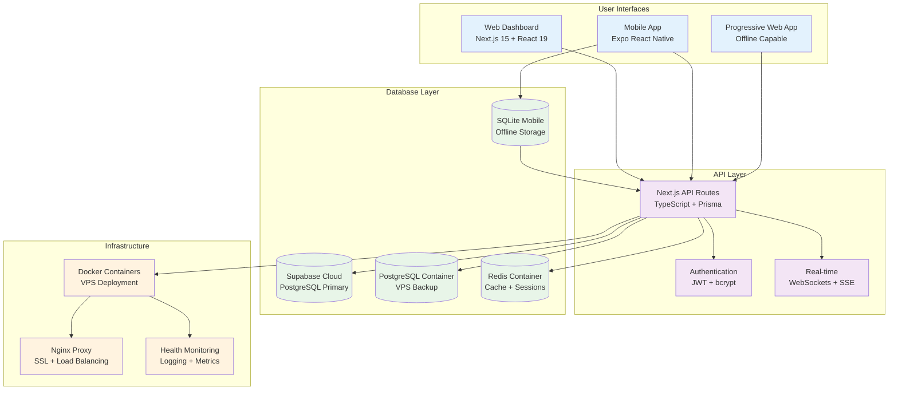
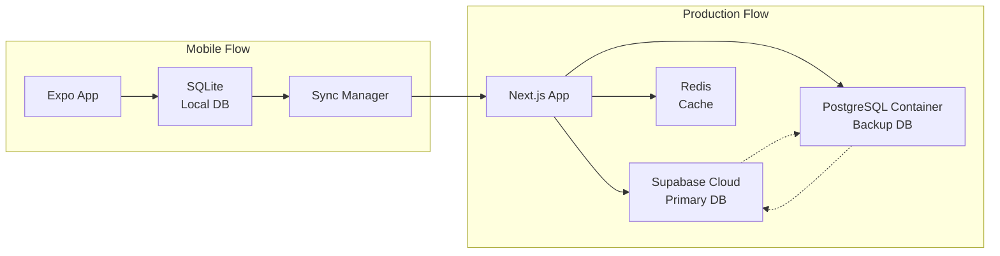
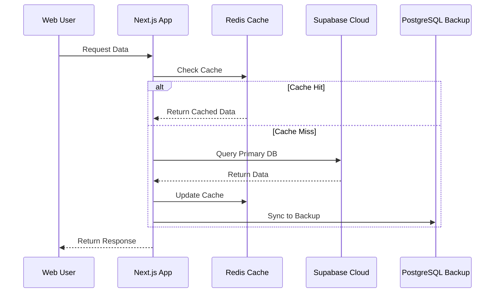
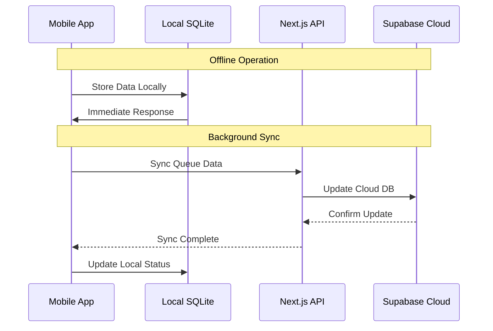

# 🏗️ TacticalOps Project Architecture

## 📋 **System Overview**

TacticalOps is a **hybrid multi-platform tactical operations management system** with a sophisticated multi-database architecture optimized for performance, reliability, and offline capabilities.

### 🎯 **Core Architecture Principles**

1. **Hybrid Multi-Database**: Supabase Cloud + PostgreSQL Container + SQLite Mobile
2. **Offline-First Mobile**: React Native with local SQLite synchronization
3. **Real-Time Web Platform**: Next.js with Supabase real-time subscriptions
4. **Tactical Theme**: Desert/Forest camo with Arabic/English RTL support
5. **Production-Ready**: Docker containerization with health monitoring

## 🏗️ **System Architecture Diagram**



## 🗄️ **Database Architecture**

### **Multi-Database Strategy**



### **Database Roles**

| Database | Role | Usage | Features |
|----------|------|-------|----------|
| **Supabase Cloud** | Primary Production | Web platform, real-time sync, analytics | RLS, Auth, Real-time, Backups |
| **PostgreSQL Container** | Backup & Networking | Local backup, provisioning, offline ops | Full PostgreSQL, PostGIS, Custom extensions |
| **Redis Container** | Cache & Sessions | High-performance caching, session storage | In-memory, Persistence, Clustering |
| **SQLite Mobile** | Mobile Local | Offline-first mobile, local caching | Embedded, Zero-config, Cross-platform |

## 🚀 **Technology Stack**

### **Frontend Technologies**

#### **Web Dashboard (Administrators)**
```yaml
Framework: Next.js 15 (App Router)
React: 19.1.0 (Server Components)
Language: TypeScript 5
UI Library: ShadCN/UI + Tailwind CSS
Theme: Tactical Camo (Desert/Forest)
Icons: Lucide React
Internationalization: Arabic/English RTL
PWA: Service Workers + Offline Support
```

#### **Mobile Application (Field Users)**
```yaml
Framework: Expo SDK 53
React Native: Latest with New Architecture
Language: TypeScript 5
Database: SQLite (Offline-first)
Synchronization: Background sync with API
Maps: React Native Maps + Mapbox
Camera: Expo Camera + Media Library
Location: Expo Location (High accuracy)
Notifications: Expo Notifications
```

### **Backend Technologies**

#### **API & Server**
```yaml
Framework: Next.js 15 API Routes
Database ORM: Prisma (Multi-provider)
Authentication: JWT + bcrypt
Real-time: WebSockets + Server-Sent Events
Caching: Redis with persistence
Security: CORS, CSRF, Rate limiting
Validation: Zod + TypeScript
```

#### **Database Stack**
```yaml
Primary: Supabase Cloud PostgreSQL 15
Backup: PostgreSQL 15 Container
Cache: Redis 7 Container
Mobile: SQLite 3 (Latest)
Schema: Prisma unified schema
Migrations: Prisma migrations
```

### **Infrastructure**

#### **Containerization**
```yaml
Platform: Docker + Docker Compose
Base Images: Node 18 Alpine, PostgreSQL 15, Redis 7
Orchestration: Docker Compose with health checks
Networking: Custom bridge network
Volumes: Persistent data storage
```

#### **Deployment**
```yaml
VPS: Ubuntu 22.04 LTS
Proxy: Nginx with SSL termination
SSL: Let's Encrypt certificates
Monitoring: Docker health checks
Logging: Structured JSON logging
Backup: Automated database backups
```

## 🎨 **UI/UX Design System**

### **Tactical Theme**
```yaml
Primary Colors:
  - Desert Camo: Amber/Brown gradients
  - Forest Camo: Green/Brown gradients
  - Accent: Amber (#F59E0B)
  - Text: High contrast white/amber
  
Background Patterns:
  - Radial gradients simulating camo
  - Tactical grid overlays
  - Glass morphism effects
  - Backdrop blur for depth
```

### **Internationalization**
```yaml
Languages: English (LTR) + Arabic (RTL)
Implementation: React Context + JSON files
RTL Support: CSS logical properties
Font Loading: Optimized web fonts
Dynamic Switching: Runtime language toggle
```

## 🔄 **Data Flow Architecture**

### **Web Platform Data Flow**


### **Mobile Synchronization Flow**


## 🛡️ **Security Architecture**

### **Authentication & Authorization**
```yaml
Web Authentication:
  - JWT tokens with secure cookies
  - bcrypt password hashing (12 rounds)
  - Session management via Redis
  - Role-based access control (ADMIN/USER)

Mobile Authentication:
  - Secure token storage
  - Biometric authentication support
  - Certificate pinning
  - Offline authentication cache

API Security:
  - CORS configuration
  - Rate limiting (1000 req/hour)
  - Input validation (Zod schemas)
  - SQL injection prevention (Prisma)
```

### **Data Protection**
```yaml
Encryption:
  - HTTPS/TLS 1.3 for all communications
  - Database encryption at rest
  - JWT token encryption
  - Sensitive data field encryption

Privacy:
  - Row Level Security (Supabase)
  - Data anonymization options
  - GDPR compliance ready
  - Audit logging
```

## 📊 **Performance Optimization**

### **Caching Strategy**
```yaml
L1 Cache: Redis (1-60 seconds)
  - API responses
  - Session data
  - Real-time updates

L2 Cache: PostgreSQL (1-60 minutes)
  - Computed aggregations
  - Materialized views
  - Query result cache

L3 Cache: Supabase (1-24 hours)
  - Static reference data
  - User preferences
  - Configuration data

L4 Cache: SQLite Mobile (Persistent)
  - Offline data
  - User-specific cache
  - Media files
```

### **Performance Metrics**
```yaml
Web Platform:
  - First Load: < 2 seconds
  - API Response: < 100ms average
  - Real-time Updates: < 50ms latency

Mobile Application:
  - App Launch: < 1 second
  - Offline Operations: Instant
  - Sync Completion: < 5 seconds

Database Performance:
  - Query Response: < 10ms average
  - Connection Pool: 20 connections
  - Cache Hit Rate: > 90%
```

## 🚀 **Deployment Architecture**

### **Production Environment**
```yaml
VPS Configuration:
  - Ubuntu 22.04 LTS
  - 4 CPU cores, 8GB RAM
  - 100GB SSD storage
  - Docker + Docker Compose

Container Resources:
  - Next.js App: 1GB RAM, 1 CPU
  - PostgreSQL: 512MB RAM, 0.5 CPU
  - Redis: 256MB RAM, 0.25 CPU

Network Configuration:
  - Nginx reverse proxy
  - SSL termination
  - Custom bridge network
  - Health check endpoints
```

### **Monitoring & Logging**
```yaml
Health Monitoring:
  - Container health checks
  - API endpoint monitoring
  - Database connection monitoring
  - Redis connectivity checks

Logging Strategy:
  - Structured JSON logs
  - Log rotation and retention
  - Error tracking and alerting
  - Performance metrics collection
```

## 🎯 **Development Workflow**

### **Local Development**
```bash
# Start development environment
cd modern-dashboard && npm run dev

# Start mobile development
cd react-native-app && npx expo start

# Database operations
npm run db:push      # Push schema changes
npm run db:studio    # Open Prisma Studio
npm run db:migrate   # Run migrations
```

### **Production Deployment**
```bash
# Deploy with Supabase architecture
./deploy-supabase-architecture.sh

# Manual deployment steps
docker-compose -f docker-compose.vps-fixed.yml up -d
```

## 📱 **Mobile Application Architecture**

### **Offline-First Strategy**
```yaml
Data Storage:
  - SQLite for local persistence
  - Encrypted sensitive data
  - Optimized queries with indexes

Synchronization:
  - Background sync with exponential backoff
  - Conflict resolution (last-write-wins)
  - Batch operations for efficiency
  - Network-aware sync scheduling

Native Features:
  - GPS location tracking
  - Camera and media capture
  - Push notifications
  - Biometric authentication
  - Background processing
```

---

## 🎯 **Key Architectural Decisions**

### **Why This Architecture?**

1. **Supabase Cloud Primary**: Production-grade PostgreSQL with real-time features
2. **PostgreSQL Container Backup**: Local redundancy and network isolation
3. **Redis Caching**: High-performance session and data caching
4. **SQLite Mobile**: Offline-first mobile experience with zero configuration
5. **Next.js Full-Stack**: Modern React framework with API routes
6. **Docker Containers**: Consistent deployment and scaling
7. **Tactical Theme**: Military-grade UI with Arabic/English support

### **Scalability Considerations**

- **Horizontal Scaling**: Load balancer ready with multiple app instances
- **Database Scaling**: Supabase handles scaling automatically
- **Cache Scaling**: Redis clustering support for high availability
- **Mobile Scaling**: Offline-first reduces server load
- **CDN Ready**: Static assets optimized for global distribution

---

*Architecture documented: August 15, 2025*
*Version: 2.0.0 - Hybrid Multi-Database Tactical Platform*